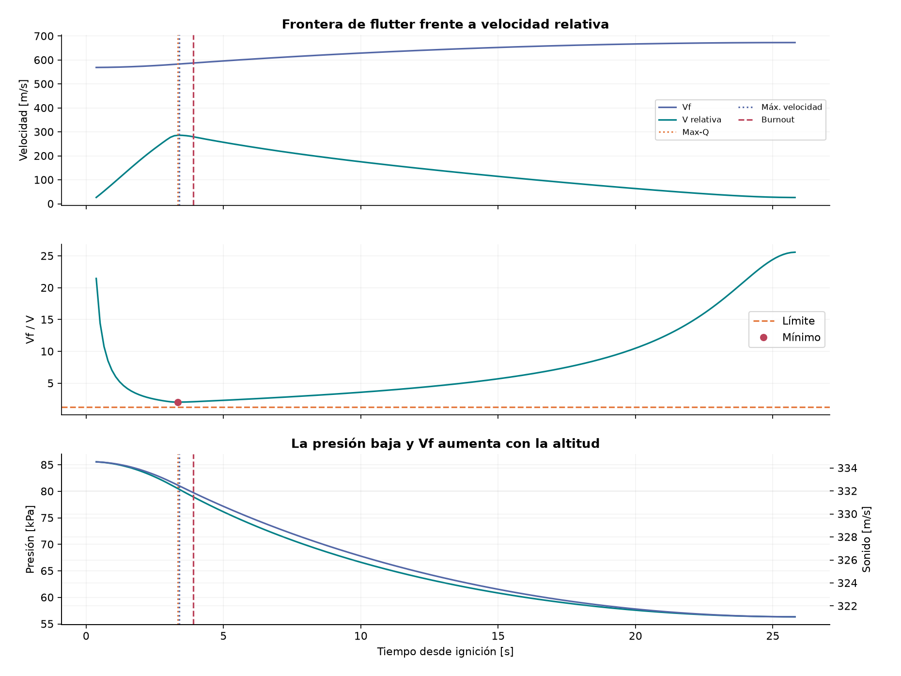
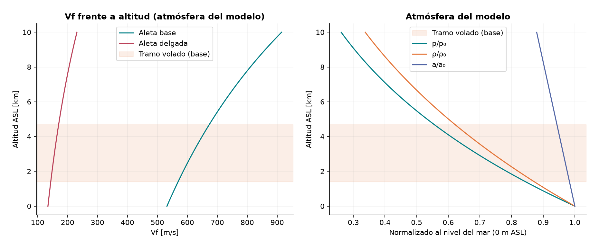
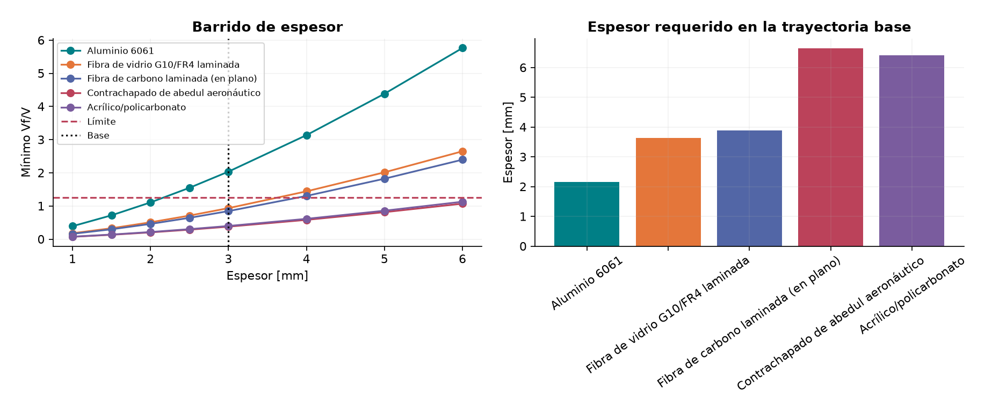
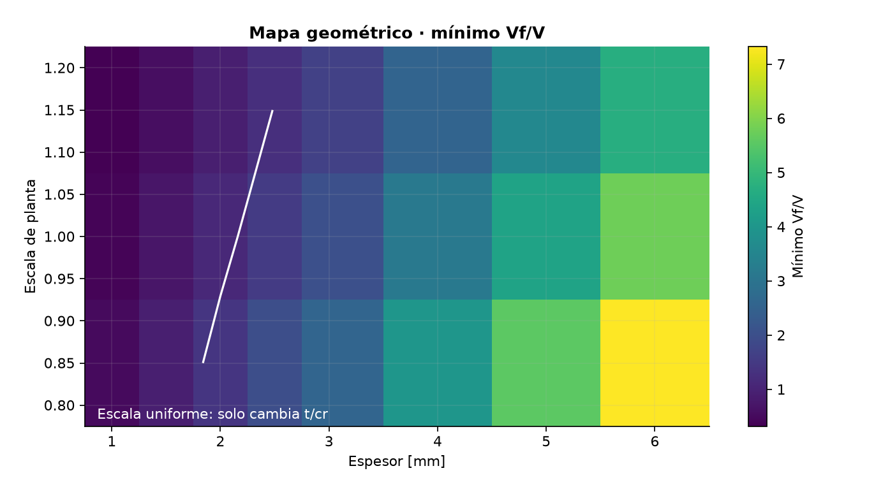

# 05 · Las siete gráficas, explicadas desde sus ejes

[Índice](../README.md) · [Anterior: código y datos](04-codigo-y-datos.md) ·
[Siguiente: metodología](06-metodologia-y-redaccion.md)

Todas las imágenes proceden de `outputs/` y usan la configuración congelada.
El caso base es payload 0 kg, escala 1, espesor 3 mm y viento 4 m/s. El
intervalo va de la salida del riel al apogeo.

## Figura 01 · `01-flight.png`

Es un resumen 2×2. Arriba izquierda: altura AGL frente al tiempo, que llega a
3287.34 m. Arriba derecha: rapidez respecto al aire y al suelo. Abajo
izquierda: \(q\) en kPa y la línea de Max-Q, 41.60 kPa cerca de 3.341 s.
Abajo derecha: margen estático en calibres y su límite.

Error común: leer AGL como ASL, o interpretar \(q\) como una propiedad de la
aleta. Las curvas son muestras de un vuelo, no una cámara experimental.

## Figura 02 · `02-flutter-history.png`

Los tres paneles comparten tiempo. Arriba compara \(V_f\) con rapidez
relativa y marca burnout, Max-Q y máxima velocidad. En el centro muestra
\(V_f/V\), su límite 1.25 y el mínimo. Abajo muestra presión estática y
velocidad del sonido en ejes gemelos.

La lectura principal es que el ratio base alcanza 2.038 cerca de Max-Q. No
hay que confundir \(V_f\) con la rapidez del vehículo.

## Figura 03 · `03-altitude.png`

Izquierda: \(V_f\) frente a altitud ASL para aleta base y delgada. Derecha:
presión, densidad y sonido normalizados al nivel de referencia. \(V_f\) puede
aumentar con altitud porque la relación entre presión, densidad y sonido
cambia; eso no significa que la rapidez de vuelo también aumente.

## Figura 04 · `04-thickness-sweep.png`

Izquierda: ratio mínimo frente a espesor, una curva por material, límite 1.25
y marcador de la base. Derecha: barras de espesor requerido para la trayectoria
base. El eje horizontal de barras contiene nombres, no valores geométricos.

Como \(V_f\propto t^{3/2}\), las curvas crecen con espesor. El barrido es
algebraico y no cambia la masa del vuelo.

## Figura 05 · `05-geometry-map.png`

El mapa cruza escala de planta y espesor, usando el viento y payload base.
El color es el ratio mínimo; la línea blanca es **Límite \(V_f/V=1.25\)**.
La escala uniforme cambia \(t/c_r\), por eso aumenta o reduce el ratio aunque
AR y taper permanezcan constantes.

No leer las celdas como simulaciones independientes de todos los diseños: el
mapa usa postprocesado algebraico sobre las historias disponibles.

## Figura 06 · `06-design-space.png`

Izquierda: apogeo frente a payload para cada escala de aleta, con viento base.
Derecha: apogeo frente a ratio mínimo; color y marcador indican admisible o
no admisible. El punto seleccionado debe satisfacer todos los escenarios de
viento previstos, no solo el punto más alto.

## Figura 07 · `07-drag-sensitivity.png`

Izquierda: altitud frente al tiempo para \(C_D\) multiplicado por 0.85, 1 y
1.15. Derecha: ratio de flutter en esas tres trayectorias. Sirve para ver si
la conclusión depende mucho del arrastre supuesto; no estima incertidumbre
estadística.

## Cómo escribir un pie de figura

> **Figura N.** Qué se muestra, con unidades y caso utilizado. El patrón
> principal es ____. Esta lectura permite ____, pero no permite concluir ____.
> La fuente numérica es `archivo.csv` o la clave correspondiente de
> `results.json`.
