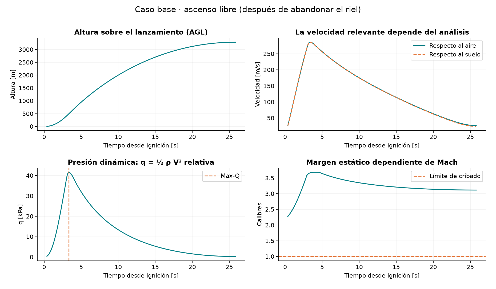
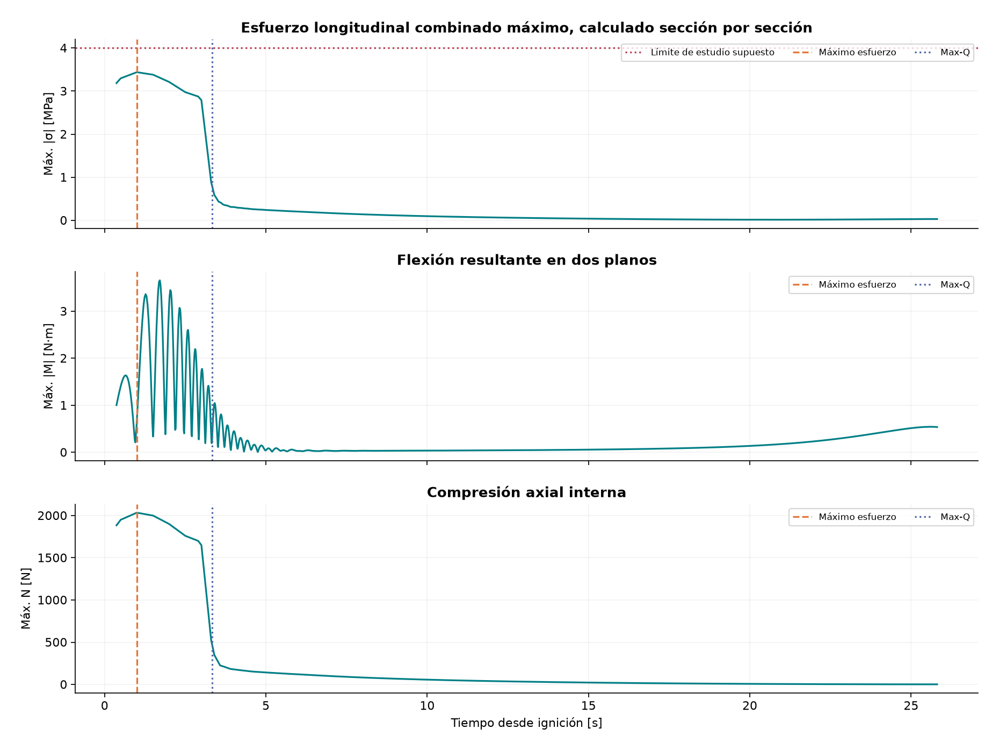
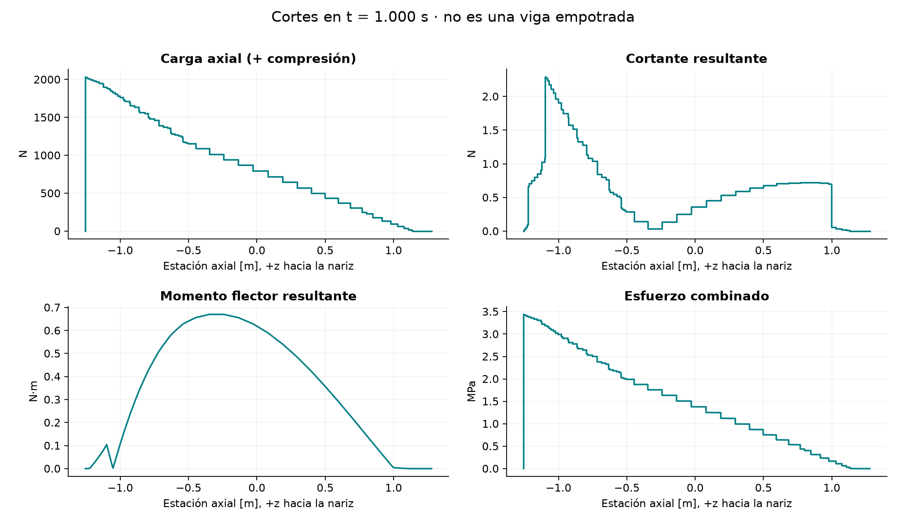
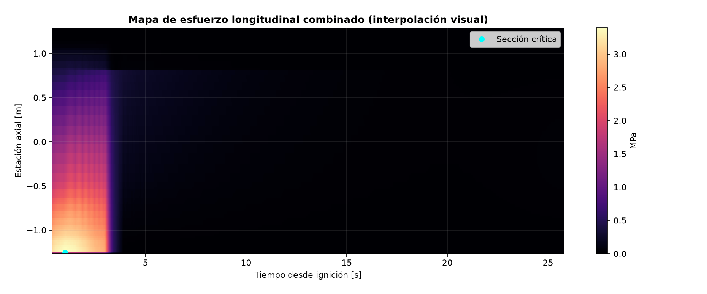
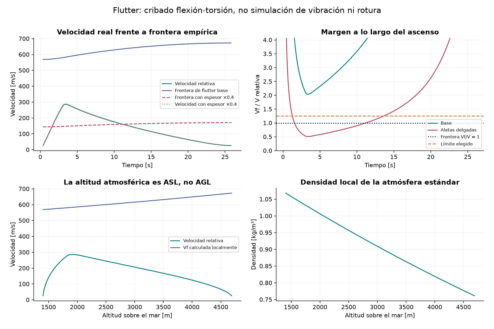
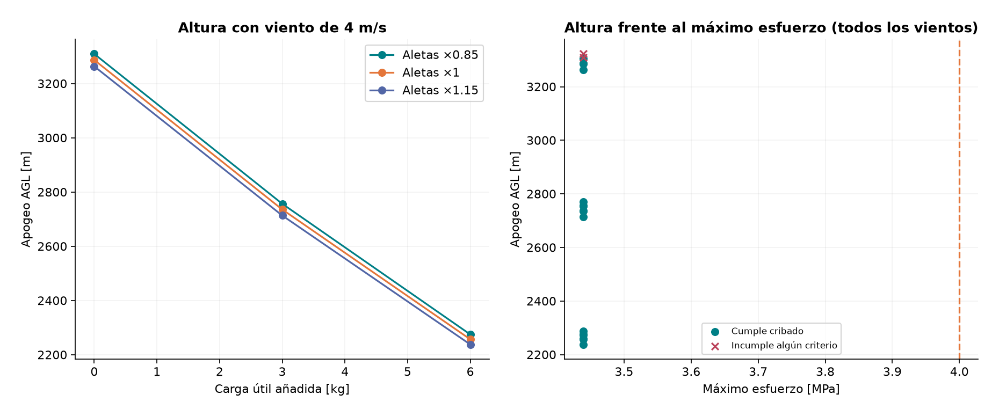
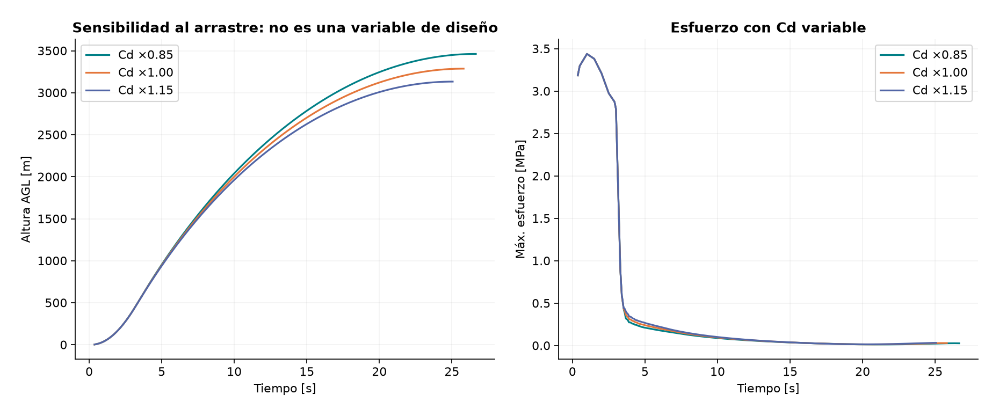

# 05 · Todas las gráficas, explicadas desde sus ejes

[Índice](../README.md) · [Anterior: código y datos](04-codigo-y-datos.md) · [Siguiente: redacción](06-metodologia-y-redaccion.md)

## Antes de interpretar cualquier curva

1. Lee qué hay en el eje horizontal y en el vertical: **no todos los gráficos tienen tiempo en horizontal**.
2. Lee las unidades; 1 kPa es 1000 Pa y 1 MPa es un millón de Pa.
3. Identifica si la curva representa un lugar fijo, el máximo entre muchos lugares o un diseño completo.
4. Revisa si el eje empieza en cero, si una curva se sale del rango o si hay puntos superpuestos.
5. Diferencia la línea dibujada, las muestras numéricas y un fenómeno físico observado.

Todas las imágenes de este capítulo provienen de la ejecución de referencia en [outputs](../outputs/). Su configuración efectiva está [aquí](../outputs/effective-config.json). El caso base es `case-004` en esta configuración: carga añadida 0 kg, aletas ×1, espesor 3 mm y viento constante de 4 m/s. Las propiedades estructurales son supuestas.

**Intervalo:** después de salir del riel, alrededor de 0.368 s, hasta el apogeo, alrededor de 25.807 s. No interpretar el máximo mostrado como máximo de toda la misión, incluyendo riel o recuperación.

| Figura | Pregunta principal | Fuente numérica |
|---|---|---|
| 01 | ¿Cómo evoluciona el vuelo? | `baseline.csv`, resumen base |
| 02 | ¿Cuándo son mayores las métricas de cargas? | `baseline.csv` |
| 03 | ¿Dónde se transmiten las cargas a un instante fijo? | `critical-diagram.csv` |
| 04 | ¿Cómo se distribuye el esfuerzo en espacio y tiempo? | Matriz calculada e interpolada para visualización |
| 05 | ¿Cómo se compara la velocidad con una frontera de flutter? | `baseline.csv`, `thin-fin.csv` |
| 06 | ¿Cómo se comparan diseños y por qué se descartan? | `cases.csv`, ranking de `results.json` |
| 07 | ¿Cuánto cambia el resultado al perturbar Cd? | `drag_sensitivity` de `results.json` y vuelos adicionales |

Las funciones que dibujan todos los paneles están en [report.py](../report.py). Sus nombres de archivo y columnas están explicados en [el capítulo 04](04-codigo-y-datos.md).

## Figura 01: vuelo, velocidad, presión dinámica y estabilidad

### Panel superior izquierdo: altura AGL frente a tiempo

- **Horizontal:** segundos desde la ignición.
- **Vertical:** altura sobre el sitio de lanzamiento, en metros.
- **Curva:** el caso base, no una comparación entre diseños.

La altura aumenta hasta aproximadamente **3287.34 m AGL**. La curva inicialmente se hace más inclinada; más tarde sigue subiendo pero se aplana. Su pendiente representa la velocidad vertical: cerca del apogeo la pendiente tiende a cero.

Que la altura continúe aumentando cuando disminuye la rapidez no es contradictorio. El cohete aún se mueve hacia arriba, pero cada vez más despacio. El final de combustión, fijado en 3.9 s para el motor del ejemplo, ocurre mucho antes del apogeo.

**No concluir:** que el cohete alcanza 3287 m sobre el mar. Su apogeo ASL es aproximadamente **4687.34 m**, porque el sitio está a 1400 m ASL. Tampoco sabemos aquí cuánto dura su descenso.

### Panel superior derecho: rapidez respecto al aire y al suelo

- **Horizontal:** tiempo, s.
- **Vertical:** rapidez, m/s.
- **Líneas:** magnitud de velocidad relativa al aire y magnitud respecto al suelo, diferenciadas por leyenda y estilo.

Las curvas son parecidas porque el viento de 4 m/s es pequeño frente a una rapidez de unos 286 m/s, pero no son idénticas. La máxima rapidez terrestre reportada es aproximadamente **285.82 m/s** y la máxima relativa muestreada **286.12 m/s**.

La velocidad puede empezar a disminuir antes del fin nominal de combustión: el empuje no es constante y la aceleración depende del balance de fuerzas, no solo de si el motor está encendido.

Al apogeo la rapidez total no llega necesariamente a cero. La velocidad vertical sí pasa por cero, pero quedan componentes horizontales y movimiento relativo al viento.

**No concluir:** que son componentes verticales o que la diferencia entre las dos curvas es siempre exactamente 4 m/s. Las velocidades se restan como vectores.

### Panel inferior izquierdo: presión dinámica

- **Horizontal:** tiempo, s.
- **Vertical:** q, en **kPa**.
- **Línea vertical:** instante de Max-Q.

El máximo es aproximadamente **41.598 kPa en 3.341 s**. La relación es `q = ρ Vrel²/2`: la rapidez creciente favorece q, mientras la disminución de densidad con altitud tiende a reducirla. Después, al disminuir también la rapidez, q cae.

Esta curva explica la escala aerodinámica disponible para producir fuerzas. Para pasar de q a una fuerza se necesitan coeficientes, áreas y direcciones; para pasar a esfuerzos internos se necesitan además geometría estructural, masas y caminos de carga.

**No concluir:** «el esfuerzo máximo es 41.598 kPa». Presión dinámica y esfuerzo del sólido no son la misma variable.

### Panel inferior derecho: margen estático

- **Horizontal:** tiempo, s.
- **Vertical:** margen estático en calibres.
- **Línea horizontal:** criterio mínimo de un calibre usado en la demo.

El mínimo del caso base es aproximadamente **2.277 calibres**, por encima del criterio. La curva puede cambiar porque se consume propelente, cambia el CG y el CP aerodinámico depende de Mach. No debe atribuirse toda la variación a una sola de esas causas sin examinarlas.

**No concluir:** que una curva alta demuestra ausencia de flutter o de fallo del tubo. El margen estático describe una relación de estabilidad de orientación, no resistencia estructural. Tampoco «más calibres siempre es mejor» para todos los objetivos de vuelo.

**Frase posible para el informe:** «El caso base mantiene un margen estático superior al criterio de cribado durante las muestras analizadas; este resultado no evalúa por sí solo estabilidad dinámica ni integridad estructural».

## Figura 02: historias de cargas máximas

Todos los paneles comparten tiempo en horizontal, pero representan métricas distintas. Cada valor de una curva es un máximo entre secciones; **la sección que lo produce puede cambiar con el tiempo**.

### Panel superior: máximo esfuerzo longitudinal combinado

- **Vertical:** máximo valor absoluto del esfuerzo longitudinal por sección, MPa.
- **Línea horizontal:** límite supuesto de estudio, 4 MPa.
- **Líneas verticales:** máximo esfuerzo y Max-Q, no dos materiales diferentes.

El máximo es aproximadamente **3.439 MPa a 1.000 s**, mientras Max-Q aparece después, cerca de 3.341 s. El mayor esfuerzo se encuentra justo delante de la estación de aplicación del empuje en la cola equivalente.

¿Por qué domina esa región? Debe transmitir esencialmente el empuje a la estructura situada delante. Con el mismo motor y área del tubo, la compresión asociada produce el máximo. La caída posterior acompaña la reducción del empuje; tras la combustión persisten otras cargas, aunque sean mucho menores.

**No concluir:** que el límite de 4 MPa viene de un ensayo del material. Es un valor de estudio configurado. Tampoco se calculó un factor de seguridad global por estar debajo de él.

### Panel central: mayor magnitud de momento flector

- **Vertical:** `max_z √(Mx²+My²)`, N·m.
- **Curva:** envolvente temporal de la flexión resultante, no esfuerzo ni desplazamiento.

El máximo de todo el intervalo es aproximadamente **3.656 N·m**. Las variaciones rápidas iniciales son variaciones de las cargas reconstruidas a partir de un vuelo con orientación y flujo local variables. Como se grafica una magnitud y además un máximo espacial, no se ve directamente el signo de cada componente ni necesariamente un único modo de giro.

**Crucial:** estas oscilaciones **no son una simulación de las aletas vibrando**. La estructura del modelo no tiene modos flexibles. Para atribuir una frecuencia concreta a un mecanismo habría que analizar también orientación, velocidades angulares, fuerzas por superficie y resolución numérica.

La flexión puede crecer algo al final aunque q sea pequeña: también importan orientación, flujo local y brazos. No se puede deducir una fuerza normal únicamente de q. Las hipótesis aerodinámicas a ángulos grandes requieren cautela.

### Panel inferior: máxima compresión axial

- **Vertical:** máximo N entre cortes, en N, positivo en compresión.
- **No es:** fuerza neta de todo el cohete, ni peso, ni esfuerzo en MPa.

El máximo inicial ronda **2034 N** a 1 s. Que se parezca al empuje se explica por la sección trasera dominante de esta representación. Eso no implica que toda unión interior transmita exactamente esa fuerza: [el corte entre dos masas](02-estructuras-y-flutter.md#2-por-qué-mirar-el-cohete-entero-no-basta) muestra por qué N depende de la sección.

Se grafica máxima compresión, no máxima tracción en valor absoluto. Una curva próxima a cero no demuestra ausencia de toda carga axial en cualquier punto.

**Conclusión conjunta:** los máximos de esfuerzo, momento y presión dinámica no son conceptos intercambiables y no deben sumarse como si ocurrieran simultáneamente en el mismo lugar.

## Figura 03: diagramas a un instante fijo

Aquí cambia la lectura fundamental:

- **Horizontal en los cuatro paneles:** estación axial dentro del modelo, en m.
- **Todo ocurre a un instante fijo:** `t = 1.000 s`, elegido por el máximo esfuerzo.
- Hacia la derecha está la nariz; las posiciones negativas no son alturas bajo tierra.

### Superior izquierdo: carga axial

Muestra cuánto esfuerzo de transmisión axial corresponde a cada corte, expresado como fuerza N. Es grande inmediatamente delante de la aplicación del empuje y cambia al atravesar las masas equivalentes y otras cargas.

Los escalones provienen de masas y fuerzas representadas en puntos. No son juntas físicas medidas. Refinar los nodos cambia la discretización de los mismos supuestos.

**Detalle de los extremos:** se incluyen cortes numéricos ligeramente fuera y dentro de las aplicaciones puntuales. Un corte exterior puede tener resultante nula y el inmediatamente interior transmitir el empuje. Ser una viga sin empotramiento no significa que una sección donde hay fuerza aplicada deba transmitir cero carga.

### Superior derecho: cortante resultante

- **Vertical:** `√(Vx²+Vy²)`, N.
- Expresa la transmisión transversal interna.

Los cambios bruscos aparecen al cruzar cargas puntuales equivalentes. El cálculo conserva signos de componentes; esta gráfica muestra solamente la magnitud. Por eso no debes interpretar cada mínimo como un cambio de signo de un diagrama plano.

### Inferior izquierdo: momento flector resultante

- **Vertical:** magnitud del momento, N·m.
- Depende de las fuerzas y de las distancias a cada corte.

En este instante su máximo es del orden de **0.67 N·m**, mucho menor que el máximo de **3.656 N·m** de toda la historia en la figura 02. No hay contradicción: se ha elegido el instante de mayor **esfuerzo combinado**, no el de mayor momento.

En diagramas firmados de un plano existen relaciones entre carga, cortante y pendiente del momento. No apliques mecánicamente esas relaciones a las magnitudes resultantes de dos planos representadas aquí.

### Inferior derecho: esfuerzo longitudinal combinado

- **Vertical:** MPa.
- Se calcula N y M en la misma sección, con A e IA del tubo supuesto.

Su máximo cerca de la cola está dominado por compresión. Una zona de mayor momento no tiene por qué ser la de mayor esfuerzo combinado si N cambia entre cortes.

**No concluir:** que la nariz o un acople real tienen ese esfuerzo, porque el modelo compara todas las estaciones con una sección equivalente uniforme. No identifica la unión real que fallaría primero.

**Frase posible:** «A 1 s, el modelo concentra el máximo esfuerzo longitudinal cerca de la transferencia del empuje; esta localización está condicionada por la sección uniforme y el camino de carga adoptados».

## Figura 04: mapa de esfuerzo

- **Horizontal:** tiempo desde ignición, s.
- **Vertical:** estación axial, m.
- **Color:** esfuerzo longitudinal combinado, MPa, según la barra lateral.
- **Punto marcado:** sección e instante del máximo calculado.

Una columna vertical representa el estado a un instante. Una fila horizontal permite seguir una estación a través del tiempo. Una región clara indica mayor esfuerzo, no calor, vibración, daño acumulado o probabilidad de fallo.

La región inferior temprana es más intensa porque allí domina el esfuerzo relacionado con la aplicación del empuje. Más tarde, las magnitudes disminuyen bajo las mismas hipótesis. Un color muy oscuro no distingue a simple vista entre cero y un valor pequeño.

El mapa se interpola a **101 estaciones** para dibujar. Los cortes originales incluyen puntos a ambos lados de discontinuidades. El color no tiene la misma resolución exacta que el máximo numérico; para la cifra crítica usa el JSON o el diagrama, no el píxel más claro.

**No concluir:** que se trata de un resultado de elementos finitos o una distribución de presión sobre una superficie tridimensional. Es un mapa de la viga axial equivalente.

## Figura 05: frontera de flutter y atmósfera

### Superior izquierdo: velocidad frente a frontera nominal

- **Horizontal:** tiempo, s.
- **Vertical:** velocidad, m/s.
- **Curvas:** rapidez relativa del caso base, frontera Vf base, frontera con espesor ×0.4 y rapidez relativa del caso delgado.

Compara siempre la rapidez y la frontera **del mismo caso**. Las aletas delgadas tienen espesor **1.2 mm** en lugar de 3 mm. Cambian tanto la frontera empírica como la masa de aletas, por lo que se vuelve a simular su vuelo.

La reducción de espesor por un factor 0.4 reduce Vf por `0.4^(3/2) ≈ 0.253` a iguales condiciones atmosféricas y resto de geometría. El margen final no baja exactamente por ese factor porque también cambia ligeramente la trayectoria.

El cruce de líneas señala que la velocidad relativa supera la frontera nominal del caso. **No es una animación ni una predicción de desprendimiento**.

### Superior derecho: margen Vf/Vrel

- **Vertical:** cociente sin unidad.
- **Línea 1:** frontera nominal.
- **Línea 1.25:** criterio elegido para el cribado.

El caso base tiene un mínimo aproximado de **2.038**. El caso delgado tiene **0.510**, por debajo de 1. La figura muestra claramente cómo una buena altura o un esfuerzo bajo en el tubo no bastan para cumplir el chequeo de aletas.

El eje vertical está limitado para ampliar la región crítica. Cerca del inicio y del apogeo, el cociente puede superar la parte superior del dibujo porque Vrel es pequeña. Que la línea salga del marco no significa que el cálculo se interrumpa.

Bajo geometría y G constantes y atmósfera ideal coherente, la fórmula conduce a `Rf² ∝ 1/q`. Por eso el mínimo de margen se encuentra cerca de Max-Q en estos casos. [La derivación y sus condiciones](02-estructuras-y-flutter.md#12-relación-especial-entre-flutter-y-max-q-en-este-modelo) impiden presentarlo como un hallazgo experimental independiente.

### Inferior izquierdo: velocidades frente a altitud

- **Horizontal:** **altitud ASL**, m, no tiempo ni altura AGL.
- **Vertical:** velocidad, m/s.
- **Curvas:** rapidez relativa y Vf del caso base.

Se consultan presión y velocidad del sonido a cada altitud. En este ambiente, la frontera nominal aumenta al ascender, mientras la rapidez primero aumenta y luego disminuye. El resultado debe interpretarse junto a la trayectoria, no como una única velocidad máxima admisible en cualquier altura.

El instante crítico de flutter base se sitúa alrededor de **1898.49 m ASL**, es decir, unos **498.49 m sobre el lanzamiento**. Confundir ambas cotas alteraría la consulta de atmósfera.

### Inferior derecho: densidad frente a altitud ASL

- **Vertical:** densidad del aire, kg/m³.
- **Curva:** perfil atmosférico usado, no mediciones meteorológicas de ese día.

La densidad disminuye con la altitud en el intervalo mostrado. Esa disminución influye en q y, mediante la relación termodinámica de la fórmula, en Vf. La función de flutter recibe p y velocidad del sonido, no una densidad independiente desconectada de ellas.

**No concluir:** que la densidad de la aleta está cambiando ni que un único perfil estándar representa toda la variabilidad atmosférica real.

## Figura 06: comparación de diseños

### Panel izquierdo: apogeo frente a carga útil añadida

- **Horizontal:** carga adicional de 0, 3 y 6 kg.
- **Vertical:** apogeo AGL, m.
- **Líneas:** tres escalas de aleta.
- **Viento fijo:** 4 m/s.

Los puntos son simulaciones distintas. Los segmentos solo ayudan a ver tendencias: **no demuestran que se hayan simulado todos los valores intermedios**.

Con aletas ×1, los apogeos son aproximadamente:

| Masa añadida | Apogeo AGL |
|---:|---:|
| 0 kg | 3287.34 m |
| 3 kg | 2736.00 m |
| 6 kg | 2257.13 m |

La tendencia es compatible con el aumento de masa bajo el mismo motor y condiciones, junto con los demás cambios acoplados que calcula el programa. No prueba una ley universal de altura decreciente para cualquier diseño.

Las aletas pequeñas alcanzan más altura en esta malla, pero **no se calculó una reducción específica de su Cd total**. No atribuir el resultado a una aerodinámica de arrastre que no se ha modelado. Además, el mejor apogeo bruto no siempre pasa los criterios.

### Panel derecho: apogeo frente a máximo esfuerzo

- **Horizontal:** máximo esfuerzo de cada caso, MPa.
- **Vertical:** apogeo AGL, m.
- **Símbolos:** casos que pasan o incumplen algún criterio.
- **Línea vertical:** límite supuesto de 4 MPa.

Se incluyen **los dos vientos**. Hay puntos que prácticamente se superponen. Todos los máximos de esfuerzo están alrededor de **3.439 MPa**, formando una columna casi vertical; no es una frontera de Pareto estructural demostrada.

Las cruces no significan necesariamente que se superó 4 MPa. Los casos de 0 kg y aletas ×0.85 se descartan por margen estático de aproximadamente **0.903 calibres**, menor al criterio de 1, aunque su esfuerzo pase el límite.

El ranking por menor apogeo entre los dos vientos es:

| Diseño | Menor apogeo AGL | Estado relevante |
|---|---:|---|
| +0 kg, aletas ×0.85 | 3309.70 m | Descartado por estabilidad |
| +0 kg, aletas ×1 | 3287.34 m | Mejor admisible de la malla |
| +0 kg, aletas ×1.15 | 3263.89 m | Admisible, menor altura |

Los diseños con más masa añadida también están en el [ranking completo](../outputs/results.json). Si la misión requiere transportar al menos 3 kg adicionales, el criterio debe decirlo: de otro modo es esperable que una selección por altura favorezca no añadir carga.

**Conclusión honesta:** esta figura demuestra la mecánica de filtrado y las relaciones del modelo, pero el máximo estructural global no discrimina significativamente los diseños actuales. Para justificar optimización estructural real harían falta un modelo y unos límites que representen los mecanismos relevantes.

## Figura 07: sensibilidad al Cd

Estos no son tres motores ni tres materiales. Se multiplica toda la curva de Cd del caso base por 0.85, 1 y 1.15, conservando las demás entradas correspondientes.

### Panel izquierdo: altura frente a tiempo

- **Horizontal:** tiempo, s.
- **Vertical:** altura AGL, m.
- **Líneas:** tres factores de Cd.

Los apogeos resultantes son aproximadamente:

| Factor de Cd | Apogeo AGL |
|---:|---:|
| 0.85 | 3462.76 m |
| 1.00 | 3287.34 m |
| 1.15 | 3133.13 m |

A igualdad de q y área, mayor Cd significa mayor arrastre. Al resolver el vuelo completo, esa perturbación cambia la trayectoria y las propias condiciones de q. En estos tres casos, mayor Cd reduce el apogeo. Los tiempos finales difieren porque cada curva termina en su propio apogeo.

**No concluir:** que ±15% es una incertidumbre estadística medida. Es una perturbación elegida para examinar sensibilidad, sin distribución de probabilidad asociada.

### Panel derecho: esfuerzo máximo frente a tiempo

- **Vertical:** esfuerzo longitudinal máximo, MPa.
- **Líneas:** los mismos tres factores de Cd.

Las curvas iniciales prácticamente coinciden porque domina el mismo empuje transmitido por la misma sección. El máximo global sigue alrededor de **3.439 MPa**; tras la combustión se aprecian diferencias relacionadas con las cargas aerodinámicas y su transmisión en el modelo.

No se ha variado aquí la posición de aplicación del arrastre. Por tanto, este gráfico por sí solo no prueba una sensibilidad a distintos soportes o caminos de carga. Estudia **Cd**, manteniendo la aplicación de cargas definida.

**Conclusión:** una entrada puede afectar bastante a la altura y poco al máximo global de esfuerzo que domina esta representación. «Resultado poco sensible» siempre debe acompañarse de qué métrica, qué intervalo y qué perturbación se evaluaron.

## Inspector interactivo, tabla y figura auxiliar

### Curvas del inspector del HTML

El selector permite cambiar entre altura, rapidez relativa, esfuerzo máximo y margen de flutter para cada caso calculado. El eje horizontal es tiempo. Las unidades están en el nombre de la variable seleccionada.

Usa un subconjunto de hasta 240 muestras por caso para visualización. Para máximos precisos usa los CSV y resúmenes completos. Cambiar el selector no recalcula física.

### Controles de selección

Modificar el límite de esfuerzo, el margen mínimo de flutter o la carga útil mínima filtra la malla existente. Las figuras PNG y el JSON guardado no cambian al mover los controles. Si nada pasa, «ningún diseño admisible» es un resultado válido; no hay que escoger uno por defecto.

La tabla combina todos los vientos definidos por diseño. Un punto verde de un escenario aislado no basta si otro escenario del mismo diseño incumple un criterio.

### `structural_loads_calisto.png`

La genera `02_structural_loads.py` y no pertenece a las siete figuras versionadas del informe. Sus tres paneles representan esfuerzo máximo frente al tiempo, momento máximo frente al tiempo y momento frente a estación axial en el instante crítico. **El eje horizontal del tercero es posición, no tiempo.** Sus conceptos se interpretan como en las figuras 02 y 03.

## Plantilla breve para un pie de figura

> **Figura X.** [Magnitud y unidad] en función de [variable y unidad] para [caso y condiciones]. Los datos se obtuvieron con [versión/configuración]. [Línea o criterio relevante]. La representación corresponde a [alcance del modelo]; no evalúa [limitación importante].

No dejar solamente «Gráfica de resultados». El lector debe identificar qué se calculó sin tener que reconstruir todo el programa.

**Siguiente paso:** cada integrante redacta un pie y un párrafo de interpretación de una figura. Comprueben juntos que el párrafo distingue dato, mecanismo propuesto y límite de la conclusión.
